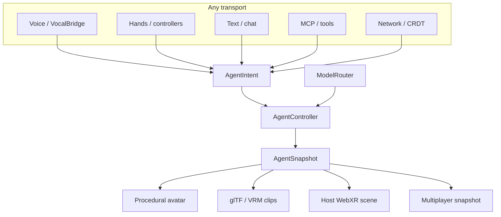

<p align="center">
  
</p>

<p align="center">
  <a href="LICENSE"></a>
  <a href="packages/agents"></a>
  
  
  
  
</p>

<p align="center"><b>Agentic Primitives for Extended Reality.</b><br>
The open rails for vocal agents, embodied avatars, spatial intents, and tool-using teammates in WebXR.</p>

<p align="center">
  <a href="#why-vr-is-still-hard">Why it exists</a> ·
  <a href="#the-worlds-we-are-building-toward">XR landscape</a> ·
  <a href="#the-primitive-stack">Primitives</a> ·
  <a href="#quick-start">Quick start</a> ·
  <a href="#powered-by-apex-vr">Powered by</a> ·
  <a href="#roadmap">Roadmap</a>
</p>

---

**APEX-VR** is a standalone TypeScript library for people who want to put *intelligence in a body* inside a shared virtual world — without rebuilding voice, animation, model routing, and intent plumbing for every scene.

It is infrastructure, not a headset app. Hosts such as [SpatiumVR](https://devpost.com/software/spatium-vibe-coding-in-spatial-environments) import the contract. Voice stacks such as [VocalBridge](https://vocalbridgeai.com) speak into it. Your renderer — Three.js, React Three Fiber, a custom WebXR session — subscribes to snapshots and draws whatever it wants.

Today that means a typed agent lifecycle, a transport-agnostic intent bus, a procedural avatar fallback, optional glTF / VRM-bound clips, and a model router. Tomorrow it means the same rails carrying MCP tools, multiplayer agent presence, and the vocal coworkers of the spatial workplace.

> Rendering and microphones stay outside the controller. Dangerous side effects stay in the host. APEX-VR owns **embodiment**: who the agent is, what they are doing, where they are standing, and which clip the world should play.

## Why VR is still hard

Generative models made it easier to write a shader, a UI mock, even a whole landing page. They did not make it easy to *inhabit* software.

A capable VR experience still asks a developer to wire, by hand:

| Layer | What you still invent |
| --- | --- |
| **Session** | WebXR enter/exit, reference spaces, controllers, hands, teleport |
| **Body** | Avatar load, retarget, clip maps, IK, look-at, locomotion |
| **Voice** | Mic permissions, STT, barge-in, TTS, transcripts, fallback text |
| **Mind** | Prompts, tools, MCP servers, approvals, model choice, latency |
| **World** | Shared state, panes, presence, conflict, who is allowed to deploy |

Those layers do not share a vocabulary. Voice SDKs mutate strings. Game engines mutate bones. Agent frameworks mutate JSON. The headset user hears a teammate *talk* while the mesh idles, or watches an avatar walk while the model is still thinking. Post-AI, the gap is sharper: the intelligence is cheap, the **embodiment contract** is missing.

APEX-VR is that contract. One `AgentIntent` from speech, hands, chat, MCP, or the network. One `AgentSnapshot` for every renderer and every peer. Rails, not a cathedral.

```text
  voice ──┐
  hands ──┤
  text  ──┼──► AgentIntent ──► AgentController ──► AgentSnapshot ──► your scene
  MCP  ───┤                         │
  net  ───┘                         ├── ModelRouter (OpenRouter today, local / Jac tomorrow)
                                    └── clips / pose / phase / utterance
```

## The worlds we are building toward

VR already has public squares, professional lobbies, hybrid meeting rooms, and spaces where human avatars stand next to non-human ones. APEX-VR does not try to replace those worlds. It gives them **agentic primitives** so a banana, a boardroom avatar, or a work robot can share the same lifecycle: listen, think, speak, act, confirm.

<table>
  <tr>
    <td align="center" width="50%">
      
      <br>
      <sub><b>Social VR is already a civilization.</b> Skins, worlds, and portals exist. Agency — a teammate that hears you and <em>does</em> something — is the missing rail.</sub>
    </td>
    <td align="center" width="50%">
      
      <br>
      <sub><b>Work is going hybrid.</b> Headset, desktop, and video in one room. Agents have to stay in sync with people who are not in VR at all.</sub>
    </td>
  </tr>
  <tr>
    <td align="center" width="50%">
      
      <br>
      <sub><b>Presence is the interface.</b> Names, bodies, and identity have to track the model: when Nova is listening, the avatar must look like it.</sub>
    </td>
    <td align="center" width="50%">
      
      <br>
      <sub><b>Humans and agents already share rooms.</b> The next decade of spatial work depends on making those agents vocal, tool-using, and trustworthy.</sub>
    </td>
  </tr>
</table>

<p align="center"><sub>Image credits at the <a href="#image-credits">foot of this README</a>. These scenes are the landscape APEX-VR is built for — not screenshots of this repository.</sub></p>

### What this enables

| Primitive | What developers stop reinventing | Where it is going |
| --- | --- | --- |
| **Vocal agents** | Map STT / client-actions onto `say`, `set_phase`, `focus_target` | Barge-in, spatial address ("Nova, look at checkout"), multi-agent floor control |
| **Agent avatars** | Procedural body now; glTF / VRM clips when you have art | Mixamo retarget, look-at, shared presence of the same body on every client |
| **Spatial intents** | Zod-validated bus for voice, hands, text, and network | MCP tools as first-class intents; approval-gated `custom` payloads |
| **Model rails** | `ModelRouter` + OpenRouter provider, keys stay off the headset | Jac byLLM, local models, tool-calling loops that still emit snapshots |
| **Work indicators** | Busy / walk / talk clips instead of a silent mesh | Visible tool use: editing a file, calling Linear, waiting on you |

The long-term picture is the **future of work in VR**: a room where you speak a change, an embodied agent walks to the surface that matters, a model proposes a patch, an MCP server talks to GitHub or Linear, and every peer sees the same phase, pose, and utterance. APEX-VR is the thin slice of that stack that should be a library — so products can compete on worlds, not on yet another agent state machine.

## The primitive stack



| Package | Role |
| --- | --- |
| [`@apex-vr/agents`](packages/agents) | Phase machine, intents, snapshots, procedural + rigged avatars, OpenRouter `ModelRouter`, React Three Fiber `AgentNPC` |

**Design rules we will not break:**

1. Controllers never import WebXR session APIs. Scenes own input.
2. Voice SDKs convert speech into `AgentIntent`. They do not mutate meshes.
3. Privileged tools (git write, deploy, payments) stay behind the host's approval layer.
4. The snapshot is the sync unit. If it is not on the snapshot, peers cannot see it.

### Lifecycle

```text
idle → listening → thinking → speaking → acting → confirming
                                              ↘ error
```

Default clip map: `idle`, `listen`, `think`, `talk`, `walk`, `work`, `point`, `celebrate`, `error`. Override per product. Phase colors in the procedural avatar (`#8b5cf6` idle, `#06b6d4` listening, ...) are part of the public visual language.

### Intent surface

Validate with `AgentIntentSchema` before accepting network or voice payloads.

| Intent | Purpose |
| --- | --- |
| `set_phase` | Drive lifecycle and the default clip |
| `say` | Store an utterance; optionally enter `speaking` |
| `attend` | Semantic focus: pane ids in, host resolves anchors |
| `execute_plan` | Versioned network plan (`attend` / `focus_target` / capability-gated `gesture`) |
| `cancel_plan` | Drop in-flight plan and locomotion |
| `move_to` | Local walk toward a world point (never on the Vektral wire) |
| `play_clip` | Force a named animation |
| `focus_target` | Point at a pane / object id |
| `set_busy` | Work indicator + `work` clip (deferred while walking) |
| `custom` | App-specific extension — MCP tool names belong here until they graduate |

## Quick start

```bash
corepack enable
pnpm install
pnpm --filter @apex-vr/agents check
pnpm --filter @apex-vr/agents test
pnpm --filter @apex-vr/agents build
```

Until `@apex-vr/agents` is published to npm, link it from a workspace:

```bash
pnpm add @apex-vr/agents@workspace:*
```

```ts
import { AgentController } from "@apex-vr/agents";

const nova = new AgentController({
  identity: { id: "nova", displayName: "Nova" },
  initialPose: { position: [0, 0, 0.25], rotationY: 0 },
});

nova.subscribe((state) => {
  console.log(state.phase, state.clip, state.pose.position);
});

nova.setPhase("listening");
nova.say("I can rearrange those panes into a wall.");
nova.moveTo([1.5, 0, -2], [0, 1, -2]);
```

React Three Fiber:

```tsx
import { Canvas } from "@react-three/fiber";
import { AgentController } from "@apex-vr/agents";
import { AgentNPC } from "@apex-vr/agents/react";

const nova = new AgentController({
  identity: { id: "nova", displayName: "Nova" },
});

export function Scene() {
  return (
    <Canvas>
      <AgentNPC controller={nova} />
    </Canvas>
  );
}
```

Model routing — **keep keys on the server**. The headset never holds the secret.

```ts
import { ModelRouter, OpenRouterProvider } from "@apex-vr/agents";

const models = new ModelRouter();
models.register(
  new OpenRouterProvider({ apiKey: process.env.OPENROUTER_API_KEY! }),
  true,
);

const reply = await models.complete({
  model: "openai/gpt-4.1-mini",
  messages: [
    { role: "system", content: "You are Nova, a concise VR coding teammate." },
    { role: "user", content: "Make checkout feel more trustworthy." },
  ],
});
```

Full API notes live in [`packages/agents/README.md`](packages/agents/README.md).

### Where this fits

```text
VocalBridge        voice transport, transcripts, client actions
@apex-vr/agents    embodiment: phase, pose, clips, model provider interface
Host app           WebXR session, panes, lobby, planner, MCP, approvals
  (SpatiumVR, ...) Yjs / Hocuspocus snapshots, GitHub / preview adapters
```

## Powered by APEX-VR

This library is young. Adoption matters more than stars: if you ship a world on these rails, we want it here.

### Spatium — vibe coding in spatial environments

[Spatium](https://devpost.com/software/spatium-vibe-coding-in-spatial-environments) is a WebXR workspace where you load a site or app, speak to a vocal agent, and watch that agent vibe-code in the room with you. It is the first host for `@apex-vr/agents`: VocalBridge for speech, OpenRouter for models, Jac for planning, and APEX-VR for the body.

The project was demonstrated at the **Mistral Vibe Hackathon** — spatial vibe coding with conversational agents rather than another 2D IDE.

<p align="center">
  <a href="https://www.youtube.com/watch?v=UNFoIvYvJrk&t=2s">
    
  </a>
  <br>
  <sub><a href="https://www.youtube.com/watch?v=UNFoIvYvJrk&t=2s">Watch the demo</a> · Mistral Vibe Hackathon · vibe coding in spatial environments</sub>
</p>

A longer maintainer walkthrough of the primitive stack will be published here.

**Using APEX-VR in production or at a lab?** Open an issue with your project name, link, and a sentence we can quote. This section is the public record of real-world use.

## Roadmap

Honest split. The contract is real; the cathedral is not done.

| Now (0.2) | Next | Further out |
| --- | --- | --- |
| `AgentController` + `PlanSequencer` + Zod v2 plans | Published npm package `@apex-vr/agents` | Multi-agent floor control in one room |
| Presence APIs that do not abort walks | Host-agnostic approval token type | Spatial tool use you can *see* (walk, point, confirm) |
| VRM look-at + capability-gated gestures | Navmesh / collision (host) | Cross-app agent passports (bring Nova into any world) |

The bet: **XR does not need another engine**. It needs a small, boring, typed layer that voice, models, MCP, and avatars can all agree on — the way web apps eventually agreed on HTTP. APEX-VR is that layer, started in public.

## Development

```bash
pnpm --filter @apex-vr/agents check   # typecheck
pnpm --filter @apex-vr/agents test    # controller + intent tests
pnpm --filter @apex-vr/agents build
```

Monorepo layout:

```text
packages/agents   @apex-vr/agents
docs/assets       banners used by this README
examples/         reserved for host-agnostic scenes
```

## Contributing

APEX-VR is MIT-licensed infrastructure. The useful contributions are the unglamorous ones: tighter types, better clip maps, more providers, tests around locomotion, docs that save someone a week of WebXR archaeology.

- **Public contract:** `AgentIntent`, `AgentSnapshot`, `AgentPhase`, `AgentClip`. Change them like you would change a wire protocol.
- **Do not** fold a specific headset, voice vendor, or planner into the controller.
- **Do** add providers behind `ModelRouter` and renderers behind `AgentNPC`.
- Open an issue before a large design change. Small fixes can land as PRs.

## License

[MIT](LICENSE) © 2026 APEX-VR contributors.

You own what you build on top. The library exists so vocal agents and avatars are not trapped inside a single product.

## Image credits

Scenes in [The worlds we are building toward](#the-worlds-we-are-building-toward) illustrate the XR landscape. They are not captures of this repo.

| Scene | Source |
| --- | --- |
| Social VR campfire under a nebula | [Voices of VR](https://voicesofvr.com/wp-content/uploads/2020/04/vrchat-2019-1102x473.png.webp) / VRChat, 2019 |
| Hybrid avatar + video meeting | [Adobe Stock](https://as2.ftcdn.net/jpg/05/38/06/41/1000_F_538064190_4USaIJla6Mjot5uSQexe3BVCIdho5WQ5.jpg) illustration, 538064190 |
| Professional lobby avatars | [Arthur](https://arthur.digital/images/blog/elevating-realism-of-virtual-collaboration-with-new-avatars-1.png) |
| Tavern with human and robot avatars | [USA Today](https://www.usatoday.com/gcdn/-mm-/cee0988b1e73b8161f906a74f138e9b76abd4125/c=0-100-1344-859/local/-/media/2016/05/27/USATODAY/USATODAY/635999642318551740-Salvatore-1.jpg?width=1344&height=672&fit=crop&format=pjpg&auto=webp) / High Fidelity, 2016 |

---

<p align="center">
  <br>
  <sub>Build the room. We will handle the ghost in it.</sub>
</p>
